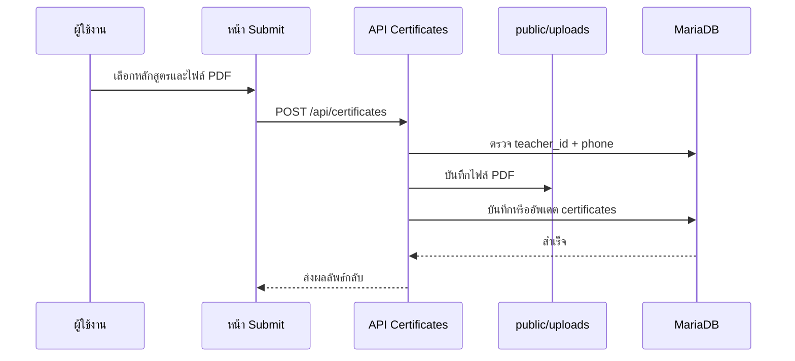
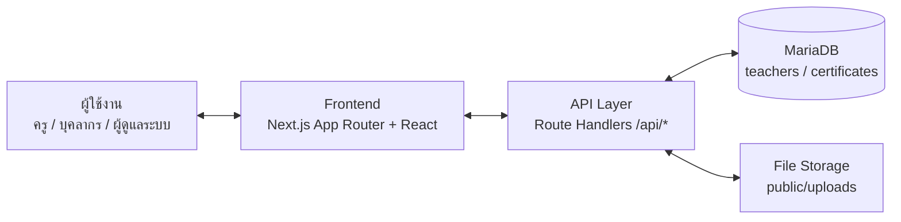
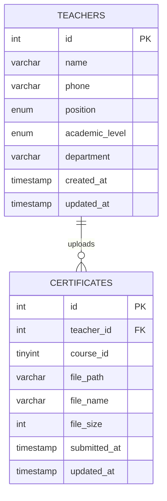

# 📘 คู่มือการใช้งานระบบส่งเกียรติบัตร Google AI Professional Certificate 2569

เอกสารฉบับนี้จัดทำขึ้นเพื่อใช้เป็นแนวทางประกอบการใช้งาน การดูแลระบบ และการอ้างอิงทางเทคนิคของระบบส่งเกียรติบัตร Google AI Professional Certificate 2569 โรงเรียนจอมทอง โดยมุ่งเน้นความชัดเจนของขั้นตอนจริง โครงสร้างข้อมูล และข้อควรระวังในการใช้งานบนระบบจริง

## 🌐 1. ภาพรวมของระบบ

ระบบส่งเกียรติบัตร Google AI Professional Certificate 2569 เป็นเว็บแอปพลิเคชันสำหรับรวบรวมไฟล์เกียรติบัตร PDF ของครูและบุคลากร โรงเรียนจอมทอง โดยรวมงานหลักไว้ในระบบเดียว ได้แก่

- 📊 แดชบอร์ดสรุปภาพรวมการส่งเกียรติบัตร
- 🔎 ค้นหาชื่อครูและบุคลากร
- 📝 ลงทะเบียนผู้ส่งเกียรติบัตรครั้งแรก
- 🔐 ยืนยันตัวตนด้วยเบอร์โทรศัพท์
- 📤 อัพโหลดไฟล์เกียรติบัตร PDF รายหลักสูตร
- 📄 เปิดดูไฟล์เกียรติบัตรผ่านระบบ
- 🗑️ ลบหรือแทนที่ไฟล์ที่ส่งผิด
- 👩‍💼 จัดการข้อมูลครูและบุคลากรจากหน้าแอดมิน
- 📥 ส่งออกข้อมูลเป็น CSV
- 🗄️ จัดเก็บข้อมูลใน MariaDB และไฟล์ใน `public/uploads`

ระบบนี้ทำงานด้วย Next.js App Router เป็นหลัก ใช้ React สำหรับส่วนติดต่อผู้ใช้ ใช้ Tailwind CSS สำหรับรูปแบบหน้าจอ ใช้ MariaDB เป็นฐานข้อมูล และ deploy บน Hostatom

## 🎯 2. เป้าหมายของระบบ

ระบบนี้ถูกออกแบบมาเพื่อแก้ปัญหา 5 เรื่องหลัก

1. ลดงานรวบรวมไฟล์เกียรติบัตรผ่านแชทหรืออีเมล
2. ให้ครูและบุคลากรส่งไฟล์ได้ด้วยตนเอง
3. ให้ผู้ดูแลตรวจสอบความคืบหน้าของแต่ละหลักสูตรได้ทันที
4. ลดความผิดพลาดจากไฟล์ซ้ำหรือชื่อไฟล์ไม่เป็นระบบ
5. เก็บข้อมูลให้พร้อมตรวจสอบและส่งออกรายงาน

## 👥 3. บทบาทผู้ใช้งาน

ระบบรองรับ 2 บทบาทหลัก

### 👩‍🏫 3.1 ครูและบุคลากร

สิทธิ์หลัก:

- ค้นหาชื่อของตนเอง
- ลงทะเบียนครั้งแรกถ้ายังไม่มีข้อมูลในระบบ
- ยืนยันตัวตนด้วยเบอร์โทรศัพท์ 10 หลัก
- อัพโหลดเกียรติบัตร PDF ของแต่ละหลักสูตร
- แทนที่ไฟล์เดิมในหลักสูตรเดิม
- ลบไฟล์ของตนเองโดยยืนยันด้วยเบอร์โทรศัพท์
- ตรวจสอบว่าตนเองส่งครบกี่หลักสูตรแล้ว

หมายเหตุ:

- เบอร์โทรศัพท์ทำหน้าที่เหมือนรหัสผ่านของผู้ส่ง
- เบอร์โทรศัพท์สามารถซ้ำกันได้หลายคน
- ระบบไม่ได้ใช้เบอร์โทรศัพท์เป็น unique login
- การยืนยันตัวตนใช้คู่ข้อมูล `teacher_id + phone`

### 👑 3.2 ผู้ดูแลระบบ

สิทธิ์หลัก:

- เข้าหน้า `/admin`
- ดูรายชื่อครูและบุคลากรทั้งหมด
- เพิ่มรายชื่อครูล่วงหน้า
- แก้ไขชื่อ เบอร์โทร ตำแหน่ง วิทยฐานะ และกลุ่มสาระ
- เปิดดูรายการเกียรติบัตรของแต่ละคน
- เปิดดูไฟล์ PDF ผ่านระบบ
- ลบไฟล์เกียรติบัตรที่ส่งผิด
- ลบข้อมูลครูและข้อมูลเกียรติบัตรที่เกี่ยวข้อง
- ส่งออกข้อมูลเป็น CSV

หมายเหตุ:

- ผู้ดูแลระบบใช้รหัสผ่านจากตัวแปรแวดล้อม `ADMIN_PASSWORD`
- API ฝั่งแอดมินต้องส่ง header `x-admin-password`
- รหัสผ่านแอดมินไม่ควรเก็บไว้ใน source code

## 🗺️ 4. หน้าใช้งานหลักของระบบ

### 🏠 4.1 หน้าสรุปภาพรวม

- `/` หน้า Dashboard สรุปภาพรวมการส่งเกียรติบัตร

ข้อมูลที่แสดง:

- จำนวนบุคลากรทั้งหมด
- จำนวนเกียรติบัตรที่ส่งแล้ว
- ความคืบหน้าภาพรวมเป็นเปอร์เซ็นต์
- จำนวนคนที่ส่งครบ 7 หลักสูตร
- ความคืบหน้ารายหลักสูตร
- ความคืบหน้าตามกลุ่มสาระ
- รายการส่งล่าสุด

### 📤 4.2 หน้าส่งเกียรติบัตร

- `/submit` หน้าใช้งานสำหรับครูและบุคลากร

ขั้นตอนหลัก:

1. ค้นหาชื่อ
2. เลือกชื่อจากผลลัพธ์หรือสมัครใหม่
3. ยืนยันตัวตนด้วยเบอร์โทรศัพท์
4. อัพโหลดไฟล์ PDF ตามหลักสูตร

### 🛠️ 4.3 หน้าผู้ดูแลระบบ

- `/admin` หน้าเข้าสู่ระบบและจัดการข้อมูล

ฟังก์ชันหลัก:

- เพิ่มครู
- แก้ไขครู
- ตรวจสอบเกียรติบัตร
- เปิดดู PDF
- ลบไฟล์
- ลบครู
- export CSV

## 🔐 5. การเข้าสู่ระบบและการยืนยันตัวตน

### 👩‍🏫 5.1 ครูและบุคลากร

1. เข้า `/submit`
2. พิมพ์ชื่อ-นามสกุล
3. เลือกชื่อของตนเอง
4. กรอกเบอร์โทรศัพท์ 10 หลัก
5. ระบบตรวจสอบจาก `teacher_id + phone`
6. ถ้าข้อมูลถูกต้อง ระบบจะแสดงหน้าส่งไฟล์

กรณีเป็นการใช้งานครั้งแรก:

- ถ้ามีชื่ออยู่แล้วแต่ยังไม่มีเบอร์โทร ระบบจะให้กรอกข้อมูลเพิ่มเติม
- ถ้าไม่พบชื่อ ระบบจะให้ลงทะเบียนใหม่
- หลังลงทะเบียน เบอร์โทรจะถูกใช้ยืนยันตัวตนในครั้งถัดไป

### 👑 5.2 ผู้ดูแลระบบ

1. เข้า `/admin`
2. กรอกรหัสผ่านผู้ดูแล
3. ระบบเรียก API `/api/admin/teachers`
4. ถ้ารหัสผ่านถูกต้อง ระบบจะแสดงหน้าแอดมิน

การตรวจสอบสิทธิ์ฝั่งแอดมิน:

```text
x-admin-password: {ADMIN_PASSWORD}
```

## 🎓 6. หลักสูตรในระบบ

ระบบกำหนดหลักสูตรไว้ใน `src/lib/courses.ts`

| ลำดับ | หลักสูตร | ระยะเวลา |
|---:|---|---:|
| 1 | AI Fundamentals | 3 ชั่วโมง |
| 2 | AI for Brainstorming and Planning | 1 ชั่วโมง |
| 3 | AI for Research and Insights | 1 ชั่วโมง |
| 4 | AI for Writing and Communicating | 1 ชั่วโมง |
| 5 | AI for Content Creation | 2 ชั่วโมง |
| 6 | AI for Data Analysis | 1 ชั่วโมง |
| 7 | AI for App Building | 2 ชั่วโมง |

รวมทั้งหมด:

- 7 หลักสูตร
- 11 ชั่วโมง
- 1 คนส่งได้สูงสุด 7 ไฟล์
- 1 หลักสูตรมีได้ 1 ไฟล์ต่อ 1 คน

## 🔄 7. ขั้นตอนการทำงานของระบบ

### 🔎 7.1 Flow การค้นหาและยืนยันตัวตน


### 📤 7.2 Flow การอัพโหลดเกียรติบัตร



### 📄 7.3 Flow การเปิดดูเกียรติบัตร

ระบบเปิดไฟล์ผ่าน API แทนการอ้าง path static โดยตรง

```text
GET /api/certificates/{certificateId}
```

เหตุผล:

- ลดปัญหา 404 จาก path static บน production
- ตรวจสอบ path ของไฟล์ก่อนส่งกลับ
- ตั้งค่า response เป็น `application/pdf`
- ควบคุมการอ่านไฟล์ให้อยู่ภายใน upload directory

## 🧱 8. โครงสร้างสถาปัตยกรรมระบบ

### 🏗️ 8.1 โครงสร้างระดับสูง



### 🔩 8.2 ส่วนประกอบหลัก

- `Frontend`
  ใช้ Next.js App Router แสดงหน้า Dashboard, Submit และ Admin

- `API Layer`
  ใช้ Route Handlers ใน `src/app/api` สำหรับค้นหา ยืนยันตัวตน อัพโหลดไฟล์ และจัดการข้อมูลแอดมิน

- `Database`
  ใช้ MariaDB เก็บข้อมูลครู บุคลากร และ metadata ของไฟล์เกียรติบัตร

- `File Storage`
  ใช้ `public/uploads/{teacherId}/course_{courseId}.pdf` สำหรับเก็บไฟล์ PDF

- `Authentication`
  ผู้ใช้งานทั่วไปยืนยันด้วย `teacher_id + phone` ส่วนผู้ดูแลระบบยืนยันด้วย `ADMIN_PASSWORD`

### 🧩 8.3 โมดูลหลักของระบบ

- `โมดูล Dashboard`
  สรุปจำนวนบุคลากร จำนวนไฟล์ และความคืบหน้า

- `โมดูล Teacher Search`
  ค้นหารายชื่อครูและบุคลากร พร้อมจำนวนไฟล์ที่ส่งแล้ว

- `โมดูล Teacher Registration`
  ลงทะเบียนครูใหม่ หรือกรอกข้อมูลครั้งแรกของรายชื่อที่แอดมินเพิ่มไว้

- `โมดูล Certificate Upload`
  รับไฟล์ PDF ตรวจสอบสิทธิ์ บันทึกไฟล์ และบันทึก metadata

- `โมดูล Admin Management`
  เพิ่ม แก้ไข ลบครู ลบไฟล์ และ export CSV

## 🗄️ 9. โครงสร้างฐานข้อมูล

### 9.1 ER Diagram



### 📚 9.2 Data Dictionary

#### 👩‍🏫 ตาราง `teachers`

ตารางนี้เก็บข้อมูลครูและบุคลากรที่มีสิทธิ์ส่งเกียรติบัตร

| ฟิลด์ | ชนิดข้อมูล | ความหมาย |
|---|---|---|
| `id` | INT | รหัสหลักของครูหรือบุคลากร |
| `name` | VARCHAR(255) | ชื่อ-นามสกุล |
| `phone` | VARCHAR(10) | เบอร์โทรศัพท์สำหรับยืนยันตัวตน สามารถซ้ำกันได้ |
| `position` | ENUM | ตำแหน่ง เช่น ผู้บริหาร, ครู, บุคลากรทางการศึกษา |
| `academic_level` | ENUM | วิทยฐานะ |
| `department` | VARCHAR(100) | กลุ่มสาระหรือหน่วยงาน |
| `created_at` | TIMESTAMP | วันที่สร้างข้อมูล |
| `updated_at` | TIMESTAMP | วันที่แก้ไขล่าสุด |

Index สำคัญ:

- `idx_name` ใช้ช่วยค้นหาชื่อ
- `idx_phone` ใช้ช่วยตรวจสอบเบอร์โทร
- `idx_department` ใช้สรุปตามกลุ่มสาระ

#### 📄 ตาราง `certificates`

ตารางนี้เก็บข้อมูลไฟล์เกียรติบัตรที่ผู้ใช้งานส่งเข้าระบบ

| ฟิลด์ | ชนิดข้อมูล | ความหมาย |
|---|---|---|
| `id` | INT | รหัสหลักของไฟล์เกียรติบัตร |
| `teacher_id` | INT | อ้างถึง `teachers.id` |
| `course_id` | TINYINT | หมายเลขหลักสูตร 1-7 |
| `file_path` | VARCHAR(500) | path ของไฟล์ เช่น `/uploads/12/course_1.pdf` |
| `file_name` | VARCHAR(255) | ชื่อไฟล์ต้นฉบับ |
| `file_size` | INT | ขนาดไฟล์เป็น byte |
| `submitted_at` | TIMESTAMP | วันที่ส่งครั้งแรก |
| `updated_at` | TIMESTAMP | วันที่แก้ไขหรือแทนที่ไฟล์ล่าสุด |

Constraint สำคัญ:

- `FOREIGN KEY (teacher_id) REFERENCES teachers(id) ON DELETE CASCADE`
- `UNIQUE KEY unique_teacher_course (teacher_id, course_id)`

## 🔌 10. API Reference

### 10.1 API สำหรับผู้ใช้งานทั่วไป

| Method | Endpoint | หน้าที่ |
|---|---|---|
| GET | `/api/dashboard` | ดึงข้อมูลสรุป Dashboard |
| GET | `/api/teachers?search={name}` | ค้นหาครูและบุคลากร |
| POST | `/api/teachers` | ลงทะเบียนครูหรือบุคลากรใหม่ |
| PUT | `/api/teachers/{id}` | กรอกข้อมูลครั้งแรกของรายชื่อที่มีอยู่ |
| POST | `/api/teachers/verify` | ตรวจสอบ `teacher_id + phone` |
| GET | `/api/certificates?teacher_id={id}` | ดึงรายการเกียรติบัตรของครู |
| POST | `/api/certificates` | อัพโหลด PDF |
| GET | `/api/certificates/{id}` | เปิดดู PDF |
| DELETE | `/api/certificates/{id}` | ลบ PDF ของตนเอง |

### 10.2 API สำหรับผู้ดูแลระบบ

ทุก request ต้องส่ง header:

```text
x-admin-password: {ADMIN_PASSWORD}
```

| Method | Endpoint | หน้าที่ |
|---|---|---|
| GET | `/api/admin/teachers` | ดึงรายชื่อครูทั้งหมด |
| POST | `/api/admin/teachers` | เพิ่มครู |
| PUT | `/api/admin/teachers/{id}` | แก้ไขข้อมูลครู |
| DELETE | `/api/admin/teachers/{id}` | ลบครู |
| DELETE | `/api/admin/certificates/{id}` | ลบไฟล์เกียรติบัตร |
| GET | `/api/admin/export` | ส่งออก CSV |

## 📁 11. โครงสร้างไฟล์สำคัญ

```text
src/
  app/
    page.tsx                         หน้า Dashboard
    submit/page.tsx                  หน้าส่งเกียรติบัตร
    admin/page.tsx                   หน้าแอดมิน
    api/
      dashboard/route.ts             API สรุปภาพรวม
      teachers/route.ts              ค้นหาและสร้างครู
      teachers/[id]/route.ts         อัพเดตข้อมูลครู
      teachers/verify/route.ts       ตรวจสอบเบอร์โทร
      certificates/route.ts          อัพโหลดและดึงรายการไฟล์
      certificates/[id]/route.ts     เปิด PDF และลบไฟล์
      admin/                         API สำหรับผู้ดูแลระบบ
  components/
    Navbar.tsx                       แถบนำทาง
    Footer.tsx                       ส่วนท้าย
    Toast.tsx                        แจ้งเตือน
  lib/
    admin-auth.ts                    ตรวจรหัสผ่านแอดมิน
    courses.ts                       ข้อมูลหลักสูตรและกลุ่มสาระ
    db.ts                            MariaDB connection pool
    types.ts                         TypeScript types
public/
  logo.png                           โลโก้โรงเรียน
  uploads/                           ที่เก็บไฟล์ PDF
docs/
  user-guide.md                      คู่มือฉบับ Markdown
  user-guide.html                    คู่มือฉบับ HTML
setup.sql                            schema ฐานข้อมูล
ftp_upload.py                        สคริปต์ deploy
```

## ⚙️ 12. การติดตั้งและตั้งค่า

### 12.1 ติดตั้ง dependencies

```bash
npm install
```

### 12.2 ตั้งค่าฐานข้อมูล

รัน `setup.sql` ใน MariaDB/MySQL

```bash
mysql -u root -p < setup.sql
```

### 12.3 ตั้งค่า environment

ตัวอย่างไฟล์ `.env.local`

```env
DB_HOST=localhost
DB_PORT=3306
DB_NAME=google_ai_cert
DB_USER=root
DB_PASSWORD=
ADMIN_PASSWORD=change-this-password
NODE_ENV=development
```

### 12.4 รันบนเครื่องพัฒนา

```bash
npm run dev
```

เปิดใช้งานที่:

```text
http://localhost:3000
```

### 12.5 ตรวจ build

```bash
npm run build
```

## 🚀 13. การ Deploy บน Hostatom

ระบบนี้เตรียม `ftp_upload.py` สำหรับอัพโหลดไฟล์ production ไป Hostatom ผ่าน FTP

ลำดับการ deploy:

1. ตรวจ `.env` หรือค่า environment สำหรับ production
2. รัน `npm run build`
3. อัพโหลด `.next/standalone`
4. อัพโหลด `.next/static`
5. อัพโหลด `public`
6. อัพโหลดไฟล์ runtime ที่จำเป็น
7. แตะ `tmp/restart.txt` เพื่อ restart app
8. ตรวจ production URL

คำสั่ง:

```bash
python3 ftp_upload.py
```

สิ่งที่ต้องตรวจหลัง deploy:

- หน้า `/` โหลดได้
- หน้า `/submit` ค้นหาชื่อได้
- หน้า `/admin` เข้าระบบได้
- API `/api/dashboard` ตอบกลับสำเร็จ
- เปิด PDF ผ่าน `/api/certificates/{id}` ได้
- อัพโหลด PDF ใหม่ได้

## 🧰 14. Troubleshooting

### 14.1 เปิดเกียรติบัตรแล้ว 404

ตรวจสอบ:

- ไฟล์มีอยู่จริงใน `public/uploads`
- `certificates.file_path` ถูกต้อง
- เปิดผ่าน `/api/certificates/{id}`
- production มีไฟล์ upload อยู่ครบ

### 14.2 เข้าแอดมินไม่ได้

ตรวจสอบ:

- ค่า `ADMIN_PASSWORD`
- app restart หลังแก้ environment แล้วหรือไม่
- API ฝั่งแอดมินได้รับ header `x-admin-password` หรือไม่

### 14.3 ค้นหาชื่อไม่เจอ

ตรวจสอบ:

- มีข้อมูลในตาราง `teachers`
- ชื่อในฐานข้อมูลสะกดถูกต้อง
- API `/api/teachers?search=...` ตอบกลับ `success: true`

### 14.4 อัพโหลด PDF ไม่สำเร็จ

ตรวจสอบ:

- ไฟล์เป็น PDF
- ขนาดไฟล์ไม่เกิน 15 MB
- โฟลเดอร์ `public/uploads` เขียนไฟล์ได้
- `teacher_id + phone` ถูกต้อง

### 14.5 build มีปัญหาจาก cache

แนวทางแก้:

```bash
rm -rf .next
npm run build
```

## ✅ 15. Checklist ก่อนใช้งานจริง

- [ ] สร้างฐานข้อมูลจาก `setup.sql`
- [ ] ตั้งค่า environment ครบ
- [ ] ตั้ง `ADMIN_PASSWORD`
- [ ] ทดสอบ Dashboard
- [ ] ทดสอบค้นหาชื่อ
- [ ] ทดสอบลงทะเบียนครั้งแรก
- [ ] ทดสอบอัพโหลด PDF
- [ ] ทดสอบเปิด PDF ผ่าน `/api/certificates/{id}`
- [ ] ทดสอบลบ PDF
- [ ] ทดสอบเพิ่มและแก้ไขครูจากหน้าแอดมิน
- [ ] ทดสอบ export CSV
- [ ] สำรองฐานข้อมูลและ `public/uploads`

## 🔒 16. หมายเหตุด้านความปลอดภัย

- ไม่ควร commit `.env.local` หรือ `.env`
- ไม่ควรเปิดเผยรหัสผ่านแอดมิน
- เบอร์โทรศัพท์ถือเป็นข้อมูลส่วนบุคคล
- หน้าแอดมินควรให้เฉพาะผู้รับผิดชอบใช้งาน
- การลบครูจะลบเกียรติบัตรที่เกี่ยวข้องด้วย
- ควรสำรองข้อมูลก่อนแก้ production ทุกครั้ง

## 🧾 17. เวอร์ชันเอกสาร

| วันที่ | รายการ |
|---|---|
| 2026-06-06 | จัดทำคู่มือฉบับ Markdown และ HTML |
